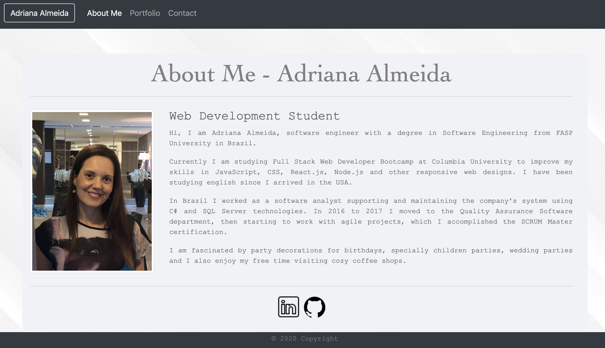
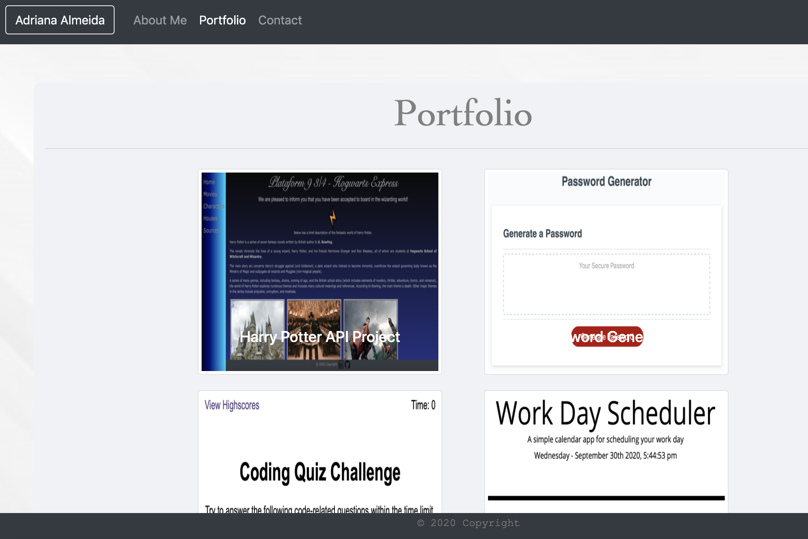
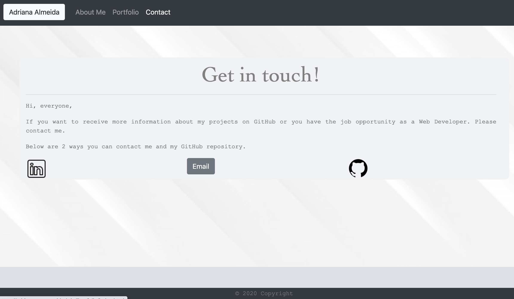

# Portfolio / bootcamp-hw-02

Responsive Portfolio
Responsive design ensures that web applications render well on a variety of devices and window or screen sizes. As a developer, you will likely be asked to create a mobile-first application or add responsive design to an existing application.

Directions
First, I used the Bootstrap CSS Framework to create a mobile responsive portfolio. How do you deliver this? Here are some guidelines:

### Technology

On an xs screen, content should take up the entire screen. On sm and larger screens, you should have some margins on the left and right sides of the screen. Check out various sites on your mobile device vs. your computer to see examples of these differences.

Navbar on each page contain links to Home/About, Contact, and Portfolio pages.

use semantic html.

Contain your personalized information. (bio, name, images, links to social media, etc.)

### Pages

### Link
https://adriana-carmo.github.io/Portfolio/